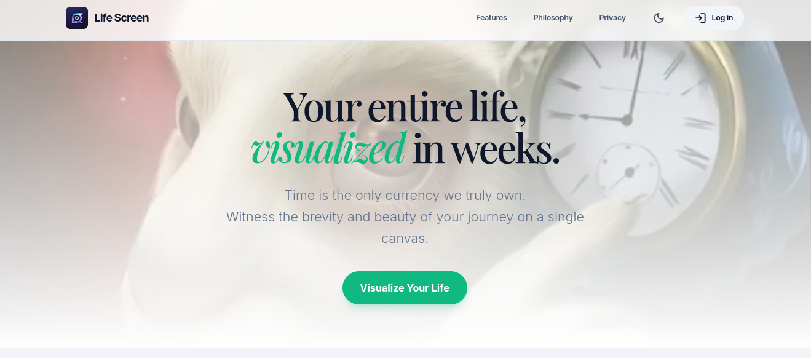
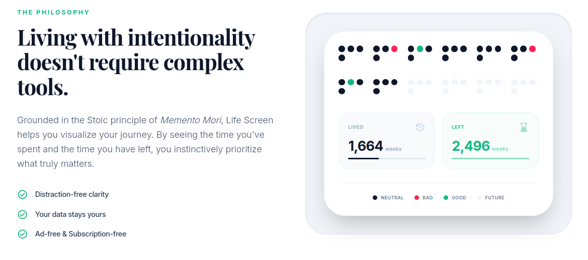
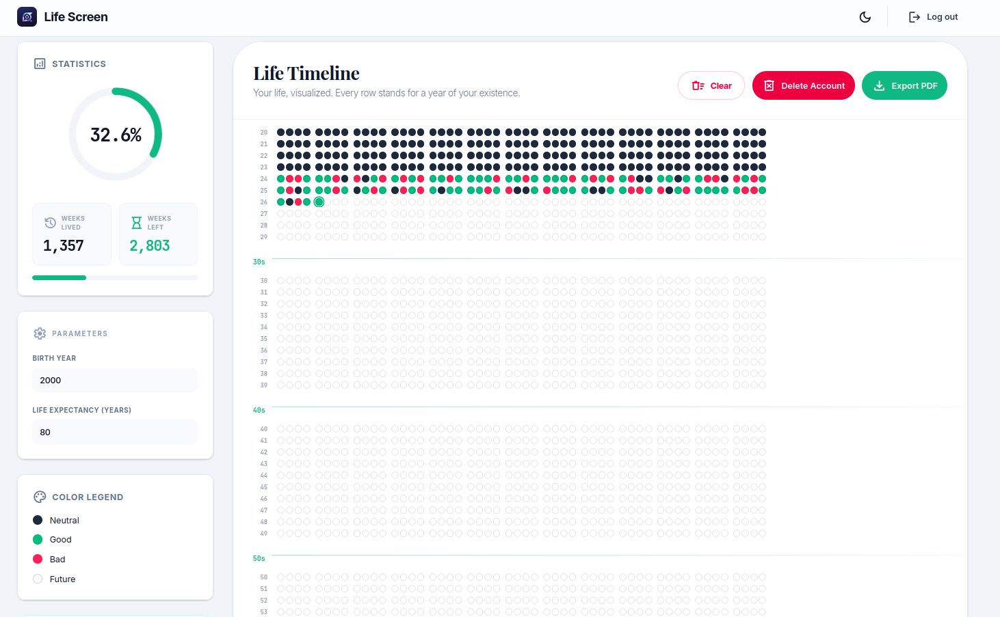

# <a href="public/logo.jpeg"></a> Life Screen

> _"Time is the only currency we truly own. Witness the brevity and beauty of your journey on a single canvas."_

**Life Screen** is a minimalist life calendar application that visualizes your entire life in weeks. Inspired by the concept of memento mori, it helps users gain perspective on the finite nature of time and encourages mindful reflection on how we spend our weeks.


---

## 📋 Table of Contents

- [Project Overview](#-project-overview)
- [Features](#-features)
- [System Architecture](#-system-architecture)
  - [Architecture Diagram](#architecture-diagram)
  - [Tech Stack](#tech-stack)
  - [Folder Structure](#folder-structure)
- [Database Schema](#-database-schema)
- [API Specifications](#-api-specifications)
- [Authentication](#-authentication)
- [Getting Started](#-getting-started)
- [Environment Variables](#-environment-variables)
- [Scripts](#-scripts)
- [Dependencies](#-dependencies)
- [Deployment](#-deployment)
- [Contributing](#-contributing)
- [License](#-license)

---

## 🎯 Project Overview

Life Screen transforms the abstract concept of time into a tangible visual representation. Each row represents one year of your life, divided into 52 weeks (13 months of 4 weeks each). Users can:

- **Visualize their life timeline** from birth to expected life expectancy
- **Mark significant weeks** with colors (good, bad, neutral)
- **Track progress** through comprehensive statistics
- **Export their calendar** as a downloadable PDF

The application supports both authenticated users (with cloud sync) and guest mode (local storage), making it accessible to everyone.

---

## ✨ Features

| Feature                            | Description                                                                                           |
| ---------------------------------- | ----------------------------------------------------------------------------------------------------- |
| 📅 **Life Calendar Visualization** | Your entire life displayed as a grid of weeks, with each row representing a year                      |
| 🎨 **Week Color Coding**           | Click any week to cycle through statuses: White (future) → Green (good) → Red (bad) → Black (neutral) |
| 📊 **Real-time Statistics**        | View weeks lived, weeks remaining, and percentage of life completed                                   |
| 🌓 **Dark/Light Mode**             | Full theme support with system preference detection                                                   |
| 📱 **Responsive Design**           | Optimized for all screen sizes                                                                        |
| 🔐 **Secure Authentication**       | Email/password and Google OAuth via Supabase                                                          |
| ☁️ **Cloud Sync**                  | Authenticated users get automatic cloud backup                                                        |
| 👤 **Guest Mode**                  | Try the app without signup (data stored locally)                                                      |
| 🔄 **Data Migration**              | Seamlessly migrate guest data to account upon signup                                                  |
| 📄 **PDF Export**                  | Download your life calendar as a high-quality PDF                                                     |
| 🗑️ **Account Management**          | Full account deletion with data cleanup                                                               |
| ⚡ **Virtualized Rendering**       | Smooth performance even with 80+ years of data                                                        |

---

## 📸 Screenshots

### Hero Section



### Philosophy Section



### Dashboard



---

## 🏗 System Architecture

### Architecture Diagram

```
┌─────────────────────────────────────────────────────────────────────────────┐
│                              CLIENT (Browser)                               │
├─────────────────────────────────────────────────────────────────────────────┤
│                                                                             │
│  ┌─────────────┐  ┌─────────────┐  ┌─────────────┐  ┌─────────────────────┐ │
│  │   Landing   │  │    Auth     │  │  Dashboard  │  │    PDF Export       │ │
│  │    Page     │  │   Pages     │  │    Page     │  │   (html2canvas +    │ │
│  │             │  │  (Login/    │  │             │  │    jsPDF)           │ │
│  │   - Hero    │  │   Signup)   │  │ - Calendar  │  └─────────────────────┘ │
│  │   - Features│  │             │  │   Grid      │                          │
│  │   - Privacy │  │   - Email   │  │ - Stats     │  ┌─────────────────────┐ │
│  └─────────────┘  │   - Google  │  │   Panel     │  │   Local Storage     │ │
│                   │     OAuth   │  │ - Parameters│  │   (Guest Mode)      │ │
│                   └─────────────┘  └─────────────┘  └─────────────────────┘ │
│                                                                             │
│  ┌───────────────────────────────────────────────────────────────────────┐  │
│  │                      React Context Providers                          │  │
│  │  ┌─────────────────┐  ┌─────────────────┐  ┌─────────────────────┐    │  │
│  │  │ ThemeContext    │  │ CalendarContext │  │   LegalProvider     │    │  │
│  │  │ (Dark/Light)    │  │ (State Mgmt)    │  │   (Terms/Privacy)   │    │  │
│  │  └─────────────────┘  └─────────────────┘  └─────────────────────┘    │  │
│  └───────────────────────────────────────────────────────────────────────┘  │
│                                                                             │
│  ┌───────────────────────────────────────────────────────────────────────┐  │
│  │                         Custom Hooks                                  │  │
│  │   useAuth │ useCalendar │ useLocalStorage │ useExportPDF │ useTheme   │  │
│  └───────────────────────────────────────────────────────────────────────┘  │
└─────────────────────────────────────────────────────────────────────────────┘
                                      │
                                      ▼
┌─────────────────────────────────────────────────────────────────────────────┐
│                           NEXT.JS APP ROUTER                                │
├─────────────────────────────────────────────────────────────────────────────┤
│                                                                             │
│  ┌──────────────────┐  ┌──────────────────┐  ┌──────────────────────────┐   │
│  │   Middleware     │  │   API Routes     │  │   Server Components      │   │
│  │                  │  │                  │  │                          │   │
│  │  - Auth session  │  │  /api/auth/      │  │   - Layout rendering     │   │
│  │    refresh       │  │    callback      │  │   - Metadata             │   │
│  │  - Route         │  │                  │  │   - Font optimization    │   │
│  │    protection    │  │  /api/account/   │  │                          │   │
│  │                  │  │    delete        │  │                          │   │
│  └──────────────────┘  └──────────────────┘  └──────────────────────────┘   │
│                                                                             │
└─────────────────────────────────────────────────────────────────────────────┘
                                      │
                                      ▼
┌─────────────────────────────────────────────────────────────────────────────┐
│                              SUPABASE                                       │
├─────────────────────────────────────────────────────────────────────────────┤
│                                                                             │
│  ┌──────────────────┐  ┌──────────────────┐  ┌──────────────────────────┐   │
│  │   Auth Service   │  │   PostgreSQL     │  │   Row Level Security     │   │
│  │                  │  │                  │  │                          │   │
│  │  - Email/Pass    │  │  - calendars     │  │   - User can only        │   │
│  │  - Google OAuth  │  │  - week_entries  │  │     access their own     │   │
│  │  - JWT tokens    │  │                  │  │     data                 │   │
│  │  - Session mgmt  │  │                  │  │                          │   │
│  └──────────────────┘  └──────────────────┘  └──────────────────────────┘   │
│                                                                             │
└─────────────────────────────────────────────────────────────────────────────┘
```

### Tech Stack

| Layer                  | Technology              | Purpose                              |
| ---------------------- | ----------------------- | ------------------------------------ |
| **Frontend Framework** | Next.js 16 (App Router) | React framework with SSR/SSG support |
| **Language**           | TypeScript 5            | Type-safe JavaScript                 |
| **UI Library**         | React 19                | Component-based UI                   |
| **Styling**            | Tailwind CSS 4          | Utility-first CSS framework          |
| **Database**           | PostgreSQL (Supabase)   | Relational database                  |
| **Authentication**     | Supabase Auth           | Email, OAuth providers               |
| **State Management**   | React Context + Hooks   | Client-side state                    |
| **PDF Generation**     | jsPDF + html2canvas     | Export functionality                 |
| **Virtualization**     | react-virtuoso          | Performant list rendering            |
| **Hosting**            | Vercel                  | Edge deployment                      |

### Folder Structure

```
life-screen/
├── public/                      # Static assets
│   └── fonts/                   # Custom fonts
│
├── src/
│   ├── app/                     # Next.js App Router
│   │   ├── globals.css          # Global styles & Tailwind
│   │   ├── layout.tsx           # Root layout (fonts, providers)
│   │   ├── page.tsx             # Landing page
│   │   │
│   │   ├── (auth)/              # Auth route group
│   │   │   ├── layout.tsx       # Auth pages layout
│   │   │   ├── login/page.tsx   # Login page
│   │   │   ├── signup/page.tsx  # Signup page
│   │   │   ├── forgot-password/ # Password reset request
│   │   │   └── reset-password/  # Password reset form
│   │   │
│   │   ├── (dashboard)/         # Dashboard route group
│   │   │   ├── layout.tsx       # Dashboard layout (sidebar, header)
│   │   │   └── dashboard/page.tsx # Main calendar view
│   │   │
│   │   └── api/                 # API routes
│   │       ├── auth/callback/   # OAuth callback handler
│   │       └── account/delete/  # Account deletion endpoint
│   │
│   ├── components/              # React components
│   │   ├── auth/                # Authentication components
│   │   │   ├── AuthModal.tsx    # Login/Signup modal
│   │   │   ├── GoogleButton.tsx # Google OAuth button
│   │   │   ├── LoginForm.tsx    # Login form
│   │   │   └── SignupForm.tsx   # Signup form
│   │   │
│   │   ├── calendar/            # Calendar components
│   │   │   ├── CalendarGrid.tsx # Main virtualized grid
│   │   │   ├── WeekSquare.tsx   # Individual week cell
│   │   │   └── PrintView.tsx    # PDF export view
│   │   │
│   │   ├── common/              # Shared components
│   │   │   └── Logo.tsx         # App logo
│   │   │
│   │   ├── dashboard/           # Dashboard components
│   │   │   ├── MigrationPrompt.tsx # Guest data migration
│   │   │   ├── ParametersForm.tsx  # Birth year/life expectancy
│   │   │   └── StatsPanel.tsx      # Statistics display
│   │   │
│   │   ├── landing/             # Landing page sections
│   │   │   ├── Hero.tsx         # Hero section
│   │   │   ├── Features.tsx     # Features showcase
│   │   │   ├── Philosophy.tsx   # Philosophy section
│   │   │   └── Privacy.tsx      # Privacy highlights
│   │   │
│   │   ├── layout/              # Layout components
│   │   │   ├── Header.tsx       # Site header
│   │   │   └── Footer.tsx       # Site footer
│   │   │
│   │   ├── legal/               # Legal components
│   │   │   └── LegalModals.tsx  # Terms & Privacy modals
│   │   │
│   │   └── ui/                  # UI primitives
│   │       └── Modal.tsx        # Reusable modal
│   │
│   ├── context/                 # React Context providers
│   │   ├── CalendarContext.tsx  # Calendar state provider
│   │   └── ThemeContext.tsx     # Theme (dark/light) provider
│   │
│   ├── hooks/                   # Custom React hooks
│   │   ├── useAuth.ts           # Authentication logic
│   │   ├── useCalendar.ts       # Calendar CRUD operations
│   │   ├── useDeleteAccount.ts  # Account deletion
│   │   ├── useExportPDF.ts      # PDF generation
│   │   ├── useIntersectionObserver.ts # Scroll animations
│   │   └── useLocalStorage.ts   # Local storage abstraction
│   │
│   ├── lib/                     # Utility libraries
│   │   ├── calculations.ts      # Date/stats calculations
│   │   ├── constants.ts         # App constants
│   │   ├── utils.ts             # General utilities
│   │   └── supabase/            # Supabase clients
│   │       ├── client.ts        # Browser client
│   │       └── server.ts        # Server client
│   │
│   ├── styles/                  # Additional styles
│   │   └── fonts.css            # Font definitions
│   │
│   ├── types/                   # TypeScript types
│   │   ├── auth.ts              # Auth types
│   │   ├── calendar.ts          # Calendar types
│   │   ├── database.ts          # Database schema types
│   │   └── index.ts             # Type exports
│   │
│   └── middleware.ts            # Next.js middleware
│
├── .env.local                   # Environment variables (not in repo)
├── eslint.config.mjs            # ESLint configuration
├── next.config.ts               # Next.js configuration
├── package.json                 # Dependencies & scripts
├── postcss.config.mjs           # PostCSS configuration
├── tailwind.config.ts           # Tailwind configuration
└── tsconfig.json                # TypeScript configuration
```

---

## 🗃 Database Schema

The application uses Supabase (PostgreSQL) with two main tables:

### Entity Relationship Diagram

```
┌─────────────────────────────────────────────────────────────────┐
│                           auth.users                            │
│                      (Supabase Auth Table)                      │
├─────────────────────────────────────────────────────────────────┤
│  id (UUID) ──────────────────────────┐                          │
│  email                               │                          │
│  created_at                          │                          │
│  ...                                 │                          │
└──────────────────────────────────────│──────────────────────────┘
                                       │
                                       │ 1:1
                                       ▼
┌─────────────────────────────────────────────────────────────────┐
│                           calendars                             │
├─────────────────────────────────────────────────────────────────┤
│  id              UUID        PRIMARY KEY                        │
│  user_id         UUID        FOREIGN KEY → auth.users.id UNIQUE │
│  birth_year      INTEGER     NOT NULL                           │
│  life_expectancy INTEGER     NOT NULL                           │
│  created_at      TIMESTAMP   DEFAULT NOW()                      │
│  updated_at      TIMESTAMP   DEFAULT NOW()                      │
└──────────────────────────────────────│──────────────────────────┘
                                       │
                                       │ 1:N
                                       ▼
┌─────────────────────────────────────────────────────────────────┐
│                         week_entries                            │
├─────────────────────────────────────────────────────────────────┤
│  id              UUID        PRIMARY KEY                        │
│  calendar_id     UUID        FOREIGN KEY → calendars.id         │
│  year_index      INTEGER     NOT NULL                           │
│  month_index     INTEGER     NOT NULL (1-13)                    │
│  week_index      INTEGER     NOT NULL (1-4)                     │
│  status          TEXT        CHECK (gray|black|green|red)       │
│  updated_at      TIMESTAMP   DEFAULT NOW()                      │
│                                                                 │
│  UNIQUE (calendar_id, year_index, month_index, week_index)      │
└─────────────────────────────────────────────────────────────────┘
```

### Table Definitions

#### `calendars`

| Column            | Type          | Constraints                                | Description                 |
| ----------------- | ------------- | ------------------------------------------ | --------------------------- |
| `id`              | `UUID`        | `PRIMARY KEY`, `DEFAULT gen_random_uuid()` | Unique identifier           |
| `user_id`         | `UUID`        | `FOREIGN KEY`, `UNIQUE`, `NOT NULL`        | References auth.users       |
| `birth_year`      | `INTEGER`     | `NOT NULL`                                 | User's birth year           |
| `life_expectancy` | `INTEGER`     | `NOT NULL`                                 | Expected life span in years |
| `created_at`      | `TIMESTAMPTZ` | `DEFAULT NOW()`                            | Creation timestamp          |
| `updated_at`      | `TIMESTAMPTZ` | `DEFAULT NOW()`                            | Last update timestamp       |

#### `week_entries`

| Column        | Type          | Constraints                                                    | Description             |
| ------------- | ------------- | -------------------------------------------------------------- | ----------------------- |
| `id`          | `UUID`        | `PRIMARY KEY`, `DEFAULT gen_random_uuid()`                     | Unique identifier       |
| `calendar_id` | `UUID`        | `FOREIGN KEY → calendars.id`                                   | Parent calendar         |
| `year_index`  | `INTEGER`     | `NOT NULL`                                                     | Year of life (1-based)  |
| `month_index` | `INTEGER`     | `NOT NULL`                                                     | Month index (1-13)      |
| `week_index`  | `INTEGER`     | `NOT NULL`                                                     | Week within month (1-4) |
| `status`      | `TEXT`        | `CHECK (status IN ('gray', 'black', 'green', 'red', 'white'))` | Week status             |
| `updated_at`  | `TIMESTAMPTZ` | `DEFAULT NOW()`                                                | Last update timestamp   |

### Row Level Security (RLS) Policies

```sql
-- Calendars: Users can only access their own calendar
CREATE POLICY "Users can view own calendar" ON calendars
  FOR SELECT USING (auth.uid() = user_id);

CREATE POLICY "Users can insert own calendar" ON calendars
  FOR INSERT WITH CHECK (auth.uid() = user_id);

CREATE POLICY "Users can update own calendar" ON calendars
  FOR UPDATE USING (auth.uid() = user_id);

CREATE POLICY "Users can delete own calendar" ON calendars
  FOR DELETE USING (auth.uid() = user_id);

-- Week Entries: Users can only access weeks in their calendar
CREATE POLICY "Users can view own weeks" ON week_entries
  FOR SELECT USING (
    calendar_id IN (SELECT id FROM calendars WHERE user_id = auth.uid())
  );

CREATE POLICY "Users can insert own weeks" ON week_entries
  FOR INSERT WITH CHECK (
    calendar_id IN (SELECT id FROM calendars WHERE user_id = auth.uid())
  );

CREATE POLICY "Users can update own weeks" ON week_entries
  FOR UPDATE USING (
    calendar_id IN (SELECT id FROM calendars WHERE user_id = auth.uid())
  );

CREATE POLICY "Users can delete own weeks" ON week_entries
  FOR DELETE USING (
    calendar_id IN (SELECT id FROM calendars WHERE user_id = auth.uid())
  );
```

### SQL Migration Script

```sql
-- Create calendars table
CREATE TABLE calendars (
  id UUID PRIMARY KEY DEFAULT gen_random_uuid(),
  user_id UUID REFERENCES auth.users(id) ON DELETE CASCADE UNIQUE NOT NULL,
  birth_year INTEGER NOT NULL,
  life_expectancy INTEGER NOT NULL,
  created_at TIMESTAMPTZ DEFAULT NOW(),
  updated_at TIMESTAMPTZ DEFAULT NOW()
);

-- Create week_entries table
CREATE TABLE week_entries (
  id UUID PRIMARY KEY DEFAULT gen_random_uuid(),
  calendar_id UUID REFERENCES calendars(id) ON DELETE CASCADE NOT NULL,
  year_index INTEGER NOT NULL,
  month_index INTEGER NOT NULL,
  week_index INTEGER NOT NULL,
  status TEXT NOT NULL CHECK (status IN ('gray', 'black', 'green', 'red', 'white')),
  updated_at TIMESTAMPTZ DEFAULT NOW(),
  UNIQUE (calendar_id, year_index, month_index, week_index)
);

-- Enable RLS
ALTER TABLE calendars ENABLE ROW LEVEL SECURITY;
ALTER TABLE week_entries ENABLE ROW LEVEL SECURITY;

-- Create indexes for performance
CREATE INDEX idx_calendars_user_id ON calendars(user_id);
CREATE INDEX idx_week_entries_calendar_id ON week_entries(calendar_id);
```

---

## 🔌 API Specifications

### API Routes

#### `GET /api/auth/callback`

Handles OAuth callback from authentication providers (Google).

**Query Parameters:**
| Parameter | Type | Description |
|-----------|----------|-----------------------------------------------------------|
| `code` | `string` | Authorization code from OAuth provider |
| `next` | `string` | Redirect URL after authentication (default: `/dashboard`) |

**Response:**

- `302 Redirect` to dashboard on success
- `302 Redirect` to error page on failure

**Example Flow:**

```
1. User clicks "Sign in with Google"
2. Redirected to Google OAuth
3. Google redirects to /api/auth/callback?code=xxx
4. Server exchanges code for session
5. User redirected to /dashboard
```

---

#### `DELETE /api/account/delete`

Permanently deletes a user's account and all associated data.

**Authentication:** Required (Bearer token in cookie)

**Response:**

Success (200):

```json
{
  "success": true
}
```

Error (401 - Unauthorized):

```json
{
  "error": "Unauthorized"
}
```

Error (500 - Server Error):

```json
{
  "error": "Failed to delete user account"
}
```

**Deletion Order:**

1. Delete all `week_entries` for user's calendar
2. Delete user's `calendar` record
3. Delete user account via Supabase Admin API

---

### Client-Side Data Operations

The application uses Supabase client SDK for real-time data operations:

#### Calendar Operations

```typescript
// Fetch user's calendar
const { data: calendar } = await supabase
  .from("calendars")
  .select("*")
  .single();

// Create/Update calendar (upsert)
const { data } = await supabase
  .from("calendars")
  .upsert(
    {
      user_id: user.id,
      birth_year: 2000,
      life_expectancy: 80,
      updated_at: new Date().toISOString(),
    },
    { onConflict: "user_id" },
  )
  .select()
  .single();
```

#### Week Entry Operations

```typescript
// Fetch all weeks for a calendar
const { data: weeks } = await supabase
  .from("week_entries")
  .select("*")
  .eq("calendar_id", calendarId);

// Upsert week status
const { data } = await supabase.from("week_entries").upsert(
  {
    calendar_id: calendarId,
    year_index: 25,
    month_index: 6,
    week_index: 2,
    status: "green",
    updated_at: new Date().toISOString(),
  },
  { onConflict: "calendar_id,year_index,month_index,week_index" },
);

// Delete a week entry (reset to default)
await supabase
  .from("week_entries")
  .delete()
  .eq("calendar_id", calendarId)
  .eq("year_index", yearIndex)
  .eq("month_index", monthIndex)
  .eq("week_index", weekIndex);
```

---

## 🔐 Authentication

### Authentication Flow Diagram

```
┌──────────────────────────────────────────────────────────────────────────┐
│                        AUTHENTICATION FLOWS                              │
└──────────────────────────────────────────────────────────────────────────┘

┌─────────────────────────────────────────────────────────────────────────┐
│  EMAIL/PASSWORD SIGNUP                                                  │
├─────────────────────────────────────────────────────────────────────────┤
│                                                                         │
│   User                    App                         Supabase          │
│    │                         │                              │           │
│    │──── Enter email ──────> │                              │           │
│    │      & password         │                              │           │
│    │                         │──── signUp(email, pass) ────>│           │
│    │                         │                              │           │
│    │                         │<─── Confirmation email ──────│           │
│    │                         │                              │           │
│    │<── "Check email" ───────│                              │           │
│    │                         │                              │           │
│    │──── Click email ──────────────────────────────────────>│           │
│    │      link               │                              │           │
│    │                         │<──── Session created ────────│           │
│    │                         │                              │           │
│    │<── Redirect to ─────────│                              │           │
│    │     /landing page       │                              │           │
│                                                                         │
└─────────────────────────────────────────────────────────────────────────┘

┌──────────────────────────────────────────────────────────────────────────────────┐
│  GOOGLE OAUTH                                                                    │
├──────────────────────────────────────────────────────────────────────────────────┤
│                                                                                  │
│   User          App                        Supabase              Google          │
│    │             │                            │                    │             │
│    │── Click ───>│                            │                    │             │
│    │   Google    │                            │                    │             │
│    │   button    │── signInWithOAuth ───>     │                    │             │
│    │             │                            │                    │             │
│    │<────────────│<── OAuth URL ─────         │                    │             │
│    │             │                            │                    │             │
│    │──────────────────────────────────────────────────────────────>│             │
│    │             │                            │  Google Auth Page  │             │
│    │             │                            │                    │             │
│    │<─────────────────────────────────────────── Redirect with ────│             │
│    │             │                            │    auth code       │             │
│    │             │                            │                    │             │
│    │─── /api/auth/callback?code=xxx ────>     │                    │             │
│    │             │                            │                    │             │
│    │             │<── exchangeCodeForSession ─│                    │             │
│    │             │                            │                    │             │
│    │<────Redirect to /dashboard ──────────────│                    │             │
│                                                                                  │
└──────────────────────────────────────────────────────────────────────────────────┘

┌──────────────────────────────────────────────────────────────────────────┐
│  GUEST MODE                                                              │
├──────────────────────────────────────────────────────────────────────────┤
│                                                                          │
│   User                     App                       LocalStorage        │
│    │                        │                              │             │
│    │── Access /dashboard ──>│                              │             │
│    │   (no auth)            │                              │             │
│    │                        │─── Read guest data ─────────>│             │
│    │                        │<─── Return or null ──────────│             │
│    │                        │                              │             │
│    │── Make changes ──────> │                              │             │
│    │                        │─── Save to localStorage ────>│             │
│    │                        │                              │             │
│    │<── Data persisted ──── │                              │             │
│    │    locally             │                              │             │
│                                                                          │
│   [Later: User signs up]                                                 │
│    │                        │                              │             │
│    │── Migration prompt ──> │                              │             │
│    │── "Yes, migrate" ────> │                              │             │
│    │                        │─── Sync to Supabase ────────>│  (DB)       │
│    │                        │─── Clear localStorage ──────>│             │
│    │                        │                              │             │
│                                                                          │
└──────────────────────────────────────────────────────────────────────────┘
```

### Authentication Methods

| Method                 | Description                                | Implementation                          |
| ---------------------- | ------------------------------------------ | --------------------------------------- |
| **Email/Password**     | Traditional signup with email confirmation | `supabase.auth.signUp()`                |
| **Google OAuth**       | One-click Google sign-in                   | `supabase.auth.signInWithOAuth()`       |
| **Password Reset**     | Email-based password recovery              | `supabase.auth.resetPasswordForEmail()` |
| **Session Management** | JWT-based sessions with auto-refresh       | Supabase SSR middleware                 |

### Middleware Protection

The application uses Next.js middleware for route protection:

```typescript
// Authenticated users are redirected from /login, /signup
if (user && isAuthPage) {
  return NextResponse.redirect("/dashboard");
}

// Unauthenticated users CAN access /dashboard (guest mode)
// No redirect needed
```

### Session Handling

- Sessions are stored in HTTP-only cookies
- Automatic token refresh via Supabase SSR
- Server-side session validation on protected API routes

---

## 🚀 Getting Started

### Prerequisites

- **Node.js** 18.x or higher
- **npm** or **yarn**
- **Supabase** account and project
- **Git** (optional, for cloning)

### Installation

1. **Clone the repository**

```bash
git clone https://github.com/MachaMelli/Life-Screen.git
cd life-screen
```

2. **Install dependencies**

```bash
npm install
```

3. **Set up Supabase**

   a. Create a new project at [supabase.com](https://supabase.com)

   b. Run the SQL migration script (see [Database Schema](#-database-schema))

   c. Enable Row Level Security policies

   d. Configure authentication providers:
   - Enable Email provider
   - (Optional) Configure Google OAuth

4. **Configure environment variables**

Create a `.env.local` file in the project root:

```env
# Supabase Configuration
NEXT_PUBLIC_SUPABASE_URL=https://your-project.supabase.co
NEXT_PUBLIC_SUPABASE_ANON_KEY=your-anon-key
SUPABASE_SERVICE_ROLE_KEY=your-service-role-key

# Optional: Custom site URL (for OAuth redirects)
NEXT_PUBLIC_SITE_URL=http://localhost:3000
```

5. **Run the development server**

```bash
npm run dev
```

6. **Open your browser**

Navigate to [http://localhost:3000](http://localhost:3000)

---

## 🔧 Environment Variables

| Variable                        | Description                             | Required | Where to Find                            |
| ------------------------------- | --------------------------------------- | -------- | ---------------------------------------- |
| `NEXT_PUBLIC_SUPABASE_URL`      | Your Supabase project URL               | ✅ Yes   | Supabase Dashboard → Settings → API Keys |
| `NEXT_PUBLIC_SUPABASE_ANON_KEY` | Supabase anonymous/public key           | ✅ Yes   | Supabase Dashboard → Settings → API Keys |
| `SUPABASE_SERVICE_ROLE_KEY`     | Supabase service role key (server-only) | ✅ Yes   | Supabase Dashboard → Settings → API Keys |

> ⚠️ **Security Note:** Never expose `SUPABASE_SERVICE_ROLE_KEY` to the client. This key bypasses Row Level Security and should only be used in server-side code.

---

## 📜 Scripts

| Command         | Description                              |
| --------------- | ---------------------------------------- |
| `npm run dev`   | Start development server with hot reload |
| `npm run build` | Build optimized production bundle        |
| `npm start`     | Start production server                  |
| `npm run lint`  | Run ESLint for code quality              |

---

## 📦 Dependencies

### Production Dependencies

| Package                 | Version | Purpose                         |
| ----------------------- | ------- | ------------------------------- |
| `next`                  | 16.1.4  | React framework with App Router |
| `react`                 | 19.2.3  | UI library                      |
| `react-dom`             | 19.2.3  | React DOM renderer              |
| `@supabase/ssr`         | ^0.8.0  | Supabase SSR integration        |
| `@supabase/supabase-js` | ^2.91.1 | Supabase JavaScript client      |
| `clsx`                  | ^2.1.1  | Conditional className utility   |
| `tailwind-merge`        | ^3.4.0  | Tailwind class deduplication    |
| `html2canvas`           | ^1.4.1  | HTML to canvas conversion       |
| `jspdf`                 | ^4.0.0  | PDF generation                  |
| `react-virtuoso`        | ^4.18.1 | Virtualized list rendering      |

### Development Dependencies

| Package                | Version | Purpose                     |
| ---------------------- | ------- | --------------------------- |
| `typescript`           | ^5      | TypeScript compiler         |
| `@types/node`          | ^20     | Node.js type definitions    |
| `@types/react`         | ^19     | React type definitions      |
| `@types/react-dom`     | ^19     | React DOM type definitions  |
| `tailwindcss`          | ^4      | Utility-first CSS framework |
| `@tailwindcss/postcss` | ^4      | Tailwind PostCSS plugin     |
| `eslint`               | ^9      | JavaScript linter           |
| `eslint-config-next`   | 16.1.4  | Next.js ESLint config       |

---

## 🌐 Deployment

### Deploy to Vercel (Recommended)

1. **Push to GitHub**

```bash
git add .
git commit -m "Initial commit"
git push origin main
```

2. **Import to Vercel**
   - Go to [vercel.com/new](https://vercel.com/new)
   - Import your GitHub repository
   - Configure environment variables
   - Deploy

3. **Configure Supabase**
   - Add your Vercel domain to Supabase Auth redirect URLs
   - Update Site URL in Supabase settings

### Security Headers

The application includes security headers configured in `next.config.ts`:

- `X-DNS-Prefetch-Control`
- `Strict-Transport-Security` (HSTS)
- `X-XSS-Protection`
- `X-Frame-Options`
- `X-Content-Type-Options`
- `Referrer-Policy`

---

## 🤝 Contributing

Contributions are welcome! Please feel free to submit a Pull Request.

1. Fork the repository
2. Create your feature branch (`git checkout -b feature/AmazingFeature`)
3. Commit your changes (`git commit -m 'Add some AmazingFeature'`)
4. Push to the branch (`git push origin feature/AmazingFeature`)
5. Open a Pull Request

---

## 📄 License

This project is open source and available under the [MIT License](LICENSE).

---

## 💡 Philosophy

> _"We have 2 lives, and the second one begins when we realize we only have one."_
> — Confucius

Life Screen helps you visualize the finite nature of time, encouraging you to make conscious decisions about how you spend your weeks. By seeing your entire life on a single canvas, you gain perspective that's impossible to achieve otherwise.

---

<p align="center">
  Made with ❤️ for those who value their time
</p>
